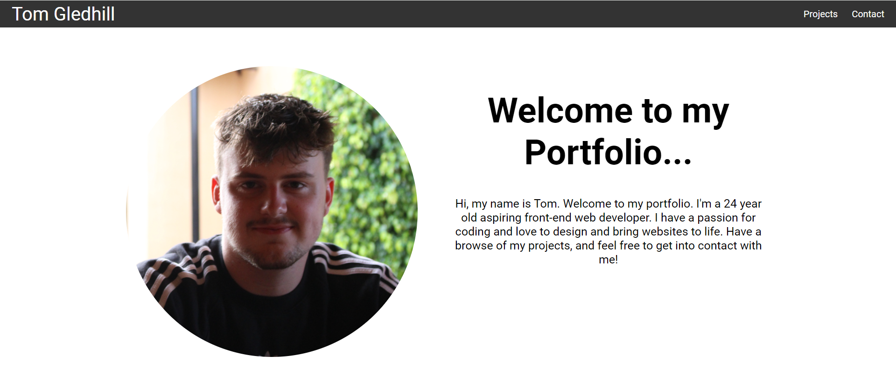

# Portfolio of Work

## Description

Welcome to my portfolio of work. This project will be added to and altered as I udate it with improved projects that focus more heavily on React and APIs. This project is live deployed on Git Pages. The live deployment can be viewed [here](https://tg-ivy.github.io/new-portfolio-tom/). (As it stands, GitHub pages is not working and throws a 404 error due to react router.) Below is an attached screenshot.

## Installation

To install this project onto your own system, you can fork the repo and clone it to your system. Once cloned, make sure to enter the "npm install" command into the terminal to install the neccessary packages. 

## Credits

edX Front-End Web Development Bootcamp

## License

Refer to the LICENSE in the repo.
